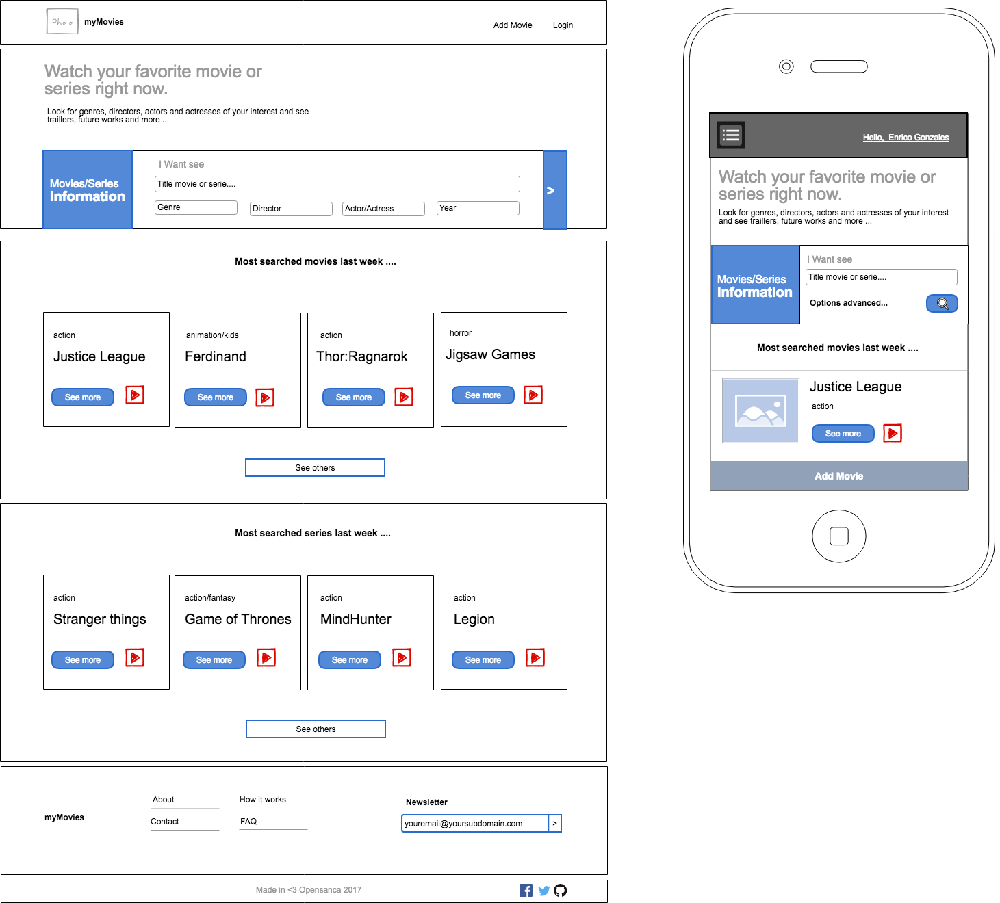

## myMovies

O MyMovies é uma empresa que ainda está lidando com papéis e impressora e deseja, um sistema 
que funcione na web da qual tem como principal objetivo saber os filmes que os usuários possuem
mais interesse em assistir. Com base nisso, ela quer que os usuários se cadastrem na plataforma,
informando seus dados, lista de generos e também os filmes e séries que gostam.

Como a proposta da empresa `MyMovies` é apenas uma ideia, ela não deseja o desenvolvimento
do back-end, mas deseja validar o fluxo de navegação, no entanto deve ser adotado algum serviço que 
faça consumo através de algum cliente HTTP  como [axios](https://github.com/axios/axios) ou 
[fetchAPI](https://developer.mozilla.org/pt-BR/docs/Web/API/Fetch_API) para retornar dados de APIs existntes
ou mesmo criar uma base de dados fakes, algumas opções de serviço que podem ser utilizado para criação
estão listados abaixo:

- [Json-Server](https://github.com/typicode/json-server) 
- [FireBase](https://firebase.google.com/) 
- [Mocky](https://designer.mocky.io/) 

De forma a facilitar a submissão dos dados, é recomendado que utilize uma API para consultar
os filmes existentes como por exemplo: [omdbAPI](http://www.omdbapi.com/). E para cadastrar,
o endereço deve ser usado por exemplo: [postmonAPI](https://postmon.com.br/).

Com base nisso, crie uma webApp utilizando Vue.js da qual deverá seguir o fluxo de navegação
no wireframe em anexo, com os comportamentos detalhados abaixo:

1. myWebPage: Renderiza uma página com alguns filmes e séries em cartaz com filtros de pesquisa.
2. myRegisterPage: Renderiza uma página para criar conta.
3. myLoginPage: Renderiza uma página para realizar login.
4. myMovieUserPage: Renderiza uma página para adicionar e remover os filmes da conta do usuário.
5. myAdminPage: Renderiza 
  - Página com uma lista dos usuários cadastrados com seus Dados Pessoais, Endereço Filmes e Séries. 
  - Dados Pessoais: Nome, E-mail, Lista de Interesse
  - Endereço
  - Filmes e Séries favoritas
 O usuário que possua uma conta de admin nesse template terá permissão para excluir o usuário.
 O usuário que possua uma conta de admin nesse template poderá fazer filtros pelo nome do usuários
 cadastrados, filmes ou séries, assim como também selecionar por genêros, diretor, nome de ator
 ou atriz e ano do filme.

 Sinta-se livre para escolher o framework CSS para criar a interface, lembre-se é mais importante
 o comportamento da interface. Segue algumas opções de lib css para uso:

 - BootstrapVue: [link](https://bootstrap-vue.org/)
 - Buefy: [link](https://buefy.org/)
 - VuetiFy: [link](https://vuetifyjs.com/)

 Os wireframes podem ser vistos nessa [url](https://cacoo.com/diagrams/ceTtkNJm6KDVf0zP/9909E)

 ## Preview

 PS: Lembre-se de adotar componentes como por exemplo o card e filtro de pesquisa.

